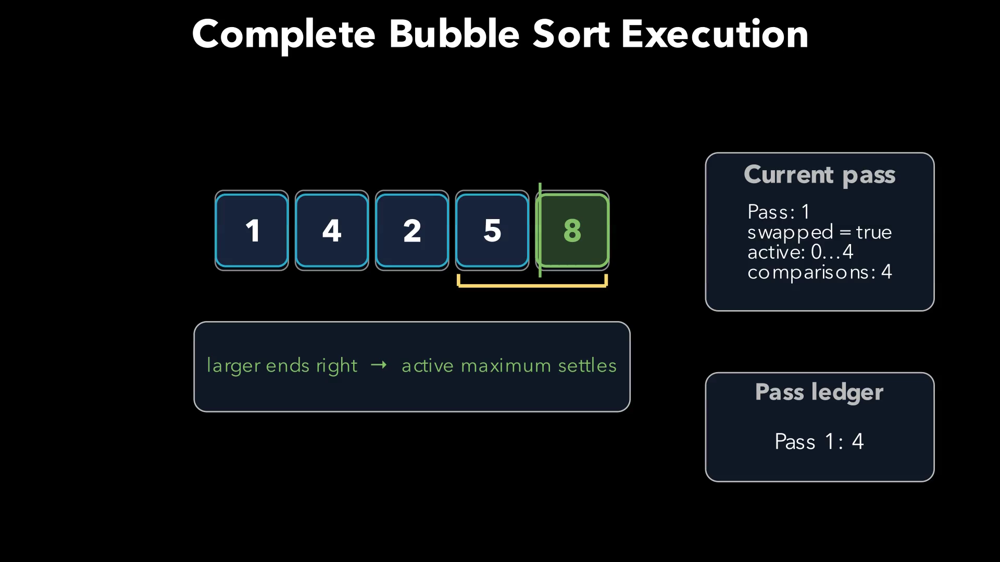
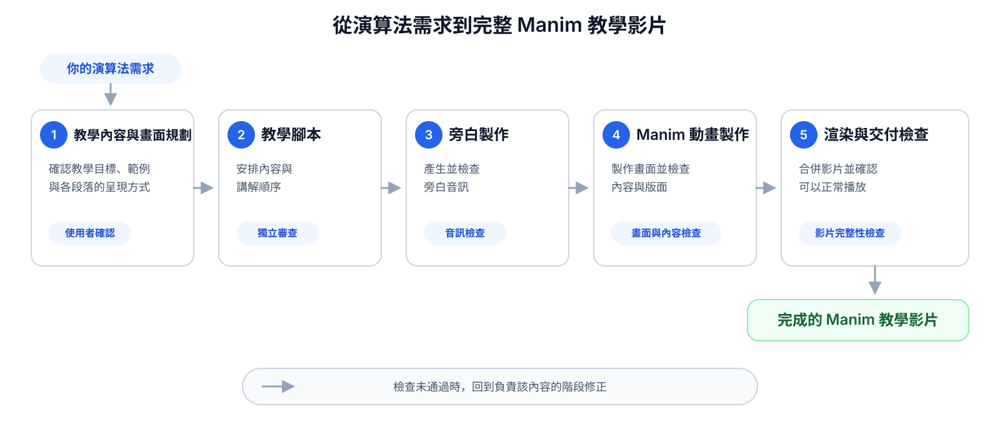

# Manim Algorithm Animation Maker

**從一句演算法需求，走到經過內容規劃、旁白製作、獨立審查與交付檢查的完整 Manim 教學影片。**

[觀看範例](#產生範例) · [快速開始](#快速開始) · [了解工作流程](#工作流程)



## 為什麼需要這個 Skill？

把演算法做成動畫，困難的不只是讓圖形動起來。真正困難的是在整段時間軸上，同時維持演算法步驟正確、教學順序清楚、畫面配置合理，以及旁白和動畫同步。

單次生成很難兼顧這些條件。早期的一個誤解，往往要到完整影片產生後才會被發現，此時修改成本也最高。

Manim Algorithm Animation Maker 將製作工作拆成一套有確認點、獨立審查與驗證紀錄的流程。它先和你確認學習目標與畫面安排，再依序完成教學腳本、逐段旁白、Manim 場景、版面檢查與最終渲染。若審查或驗證未通過，流程會回到負責該內容的階段修正，不會把問題一路帶進最終影片。

成品仍可能出現需要調整的畫面或解說。只要指出問題並說明希望如何修改，Skill 就會回到相應的製作階段修正，再重新完成必要的檢查。

## 工作流程



檢查未通過時，Skill 會回到負責該內容的階段修正。

完整規格請閱讀 [Skill 主文件](manim-algorithm-animation-maker/SKILL.md) 與 [Subagent 委派協定](manim-algorithm-animation-maker/references/subagent-delegation-protocol.md)。版面、渲染與交付檢查的細節位於 [`references/`](manim-algorithm-animation-maker/references/)。

## 快速開始

### 1. 安裝 Skill

在 Codex 中輸入：

```text
請使用 $skill-installer，從以下 GitHub repository 安裝 Skill：
https://github.com/chengen1018/manim-algorithm-animation-maker/tree/main/manim-algorithm-animation-maker
```

若要手動安裝，請將 repository 中的 `manim-algorithm-animation-maker` 資料夾放入 Codex 的個人 Skills 目錄。

### 2. 提出動畫需求

在已準備 Manim 與 Kokoro 的動畫專案目錄中，對 Codex 輸入：

```text
請使用 $manim-algorithm-animation-maker，為 Bubble Sort 製作一支完整的 Manim 教學動畫。
```

### 3. 和 Skill 一起確認內容

以下是實際製作 Bubble Sort 動畫時的精簡對話：

> **You**
>
> I want to create an animated tutorial that explains the Bubble Sort algorithm.

> **Codex**
>
> Do you have a preferred example input, or should I use `[5, 1, 4, 2, 8]`?

> **You**
>
> Use `[5, 1, 4, 2, 8]`.

> **Codex**
>
> Should viewers learn only adjacent comparisons and swaps, or also the pass invariant, early-exit optimization, and complexity derivation?

> **You**
>
> Include the invariant, early exit, and complexity.

> **Codex**
>
> Which visual approach should anchor the first three sections?

> **You**
>
> Number-card track.

> **Codex**
>
> Before planning the complexity section, please approve its teaching scope.

> **You**
>
> Use the worst case as the primary analysis and the best case as the only contrast. There is no need to explain space complexity.

> **Codex**
>
> The complete animation plan passed independent review. Do you approve it?

> **You**
>
> I approve.

完成後，你會得到一支依照需求製作、包含旁白並完成檢查的 Manim 教學影片。

## 產生範例

以下三支影片皆由本 Skill 的工作流程產生。點擊圖片即可在 YouTube 觀看。

### Quick Sort

[](https://www.youtube.com/watch?v=Lmz1Z9-1f3Q)

以陣列分割與遞迴過程呈現 Quick Sort，片長約 5 分 45 秒。

[在 YouTube 觀看](https://www.youtube.com/watch?v=Lmz1Z9-1f3Q)

### Longest Common Subsequence

[](https://www.youtube.com/watch?v=gUQMSyASYw0)

以動態規劃表格與回溯過程呈現 Longest Common Subsequence，片長約 10 分 50 秒。

[在 YouTube 觀看](https://www.youtube.com/watch?v=gUQMSyASYw0)

### Johnson Algorithm

[](https://www.youtube.com/watch?v=jqRVnd7lnlc)

呈現 Bellman–Ford、邊權重調整與重複執行 Dijkstra 的流程，片長約 11 分 43 秒。

[在 YouTube 觀看](https://www.youtube.com/watch?v=jqRVnd7lnlc)

## 執行環境

- Codex，且可以安裝本機 Skill。
- Manim 與可執行它的 Python 環境。
- FFmpeg／FFprobe。
- 能顯示影片文字語言的字型。
- Kokoro TTS；請依照 [Kokoro TTS 環境設置](KOKORO_SETUP.md) 準備。
- 可用的 subagent 功能。

> 專案目前仍在早期版本。它提供完整工作流程與本機驗證工具，但不保證所有演算法、語言或作業系統都能直接使用。

## 參與貢獻

開始修改前請閱讀 [貢獻指南](CONTRIBUTING.md)，版本變更請見 [Changelog](CHANGELOG.md)。

## 授權

本專案採用 [MIT License](LICENSE)。
