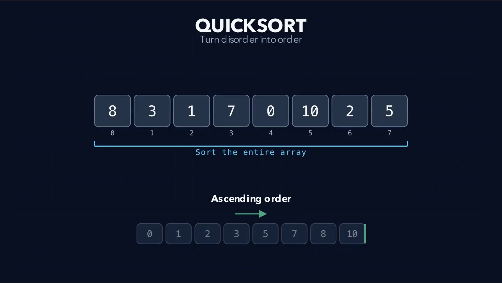
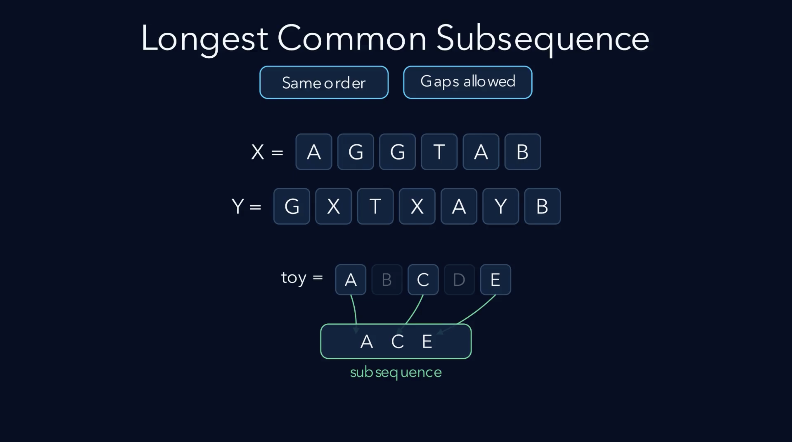
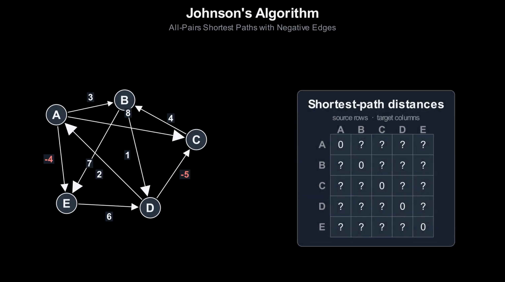

# Manim Algorithm Animation Maker

一套給 Codex 使用的 Skill，將演算法需求整理成經過設計、審查、旁白製作、Manim 實作與交付驗證的四幕教學動畫。

> 專案目前仍在早期版本。它提供完整工作流程與本機驗證工具，但不保證所有演算法、語言或作業系統都能直接使用。

## 產生範例

以下三支影片皆由本 Skill 的工作流程產生。點擊圖片可在 YouTube 觀看；完整 MP4 會隨 `v0.1.0` Release 提供下載。

### Quick Sort

[](https://www.youtube.com/watch?v=Lmz1Z9-1f3Q)

以陣列分割與遞迴過程呈現 Quick Sort，片長約 5 分 45 秒。

[在 YouTube 觀看](https://www.youtube.com/watch?v=Lmz1Z9-1f3Q) · [下載 MP4](https://github.com/chengen1018/manim-algorithm-animation-maker/releases/download/v0.1.0/QuickSort_1080p60.mp4)

### Longest Common Subsequence

[](https://www.youtube.com/watch?v=gUQMSyASYw0)

以動態規劃表格與回溯過程呈現 Longest Common Subsequence，片長約 10 分 50 秒。

[在 YouTube 觀看](https://www.youtube.com/watch?v=gUQMSyASYw0) · [下載 MP4](https://github.com/chengen1018/manim-algorithm-animation-maker/releases/download/v0.1.0/combined_lcs.mp4)

### Johnson Algorithm

[](https://www.youtube.com/watch?v=jqRVnd7lnlc)

呈現 Bellman–Ford、邊權重調整與重複執行 Dijkstra 的流程，片長約 11 分 43 秒。

[在 YouTube 觀看](https://www.youtube.com/watch?v=jqRVnd7lnlc) · [下載 MP4](https://github.com/chengen1018/manim-algorithm-animation-maker/releases/download/v0.1.0/JohnsonAlgorithmCombined.mp4)

## 為什麼需要這個 Skill？

演算法不只有最後答案。每一次比較、選擇、狀態更新與回溯都會隨時間改變。動畫可以把這些變化放在同一個視覺脈絡中，讓抽象步驟更具體。

AI 可以快速產生文字與程式碼，但單次生成不一定能同時維持演算法正確性、教學順序、畫面配置與旁白同步。這個 Skill 將工作拆成需求確認、教學設計、腳本與旁白、場景實作、正式渲染與交付檢查，並在重要階段加入獨立審查。

這套流程不取代教師或人工判斷。它的用途是把 AI 的生成能力放入清楚、可檢查的製作流程，降低直接產生完整教學影片時容易遺漏的問題。

## 工作流程

Skill 依序執行五個階段：

1. `ANIMATION_DESIGN`：確認需求並設計四幕動畫。
2. `SCRIPT`：撰寫並審查教學腳本。
3. `VOICEOVER`：產生旁白文字、音訊與驗證資料。
4. `SCENE_IMPLEMENTATION`：實作 Manim Scene，執行非渲染版面檢查與程式碼審查。
5. `FINAL_RENDER_AND_DELIVERY_CHECK`：正式渲染、合併影片並檢查媒體檔案。

完整規格請閱讀 [Skill 主文件](manim-algorithm-animation-maker/SKILL.md) 與 [Subagent 委派協定](manim-algorithm-animation-maker/references/subagent-delegation-protocol.md)。版面、渲染與交付檢查的細節位於 [`references/`](manim-algorithm-animation-maker/references/)。

## 安裝

### 前置需求

- Codex，且可以安裝本機 Skill。
- Manim 與可執行它的 Python 環境。
- FFmpeg／FFprobe。
- 能顯示影片文字語言的字型。
- Kokoro TTS；請依照 [Kokoro TTS 環境設置](KOKORO_SETUP.md) 準備。
- 可用的 subagent 功能。此 Skill 在開始動畫流程前會要求使用者明確同意使用 subagent。

### 安裝 Skill

```bash
git clone https://github.com/chengen1018/manim-algorithm-animation-maker.git
cd manim-algorithm-animation-maker
mkdir -p "${CODEX_HOME:-$HOME/.codex}/skills"
cp -R manim-algorithm-animation-maker "${CODEX_HOME:-$HOME/.codex}/skills/"
```

重新啟動 Codex 或開啟新的工作階段後，確認 Skill 清單中出現 `manim-algorithm-animation-maker`。

若希望後續 `git pull` 立即反映到 Skill 目錄，可以使用 symbolic link 取代複製：

```bash
ln -s "$(pwd)/manim-algorithm-animation-maker" "${CODEX_HOME:-$HOME/.codex}/skills/manim-algorithm-animation-maker"
```

## Quickstart

在已準備 Manim 與 Kokoro 的動畫專案目錄中，對 Codex 輸入：

```text
請使用 $manim-algorithm-animation-maker，為 Binary Search 製作一支繁體中文 Manim 教學動畫。
範例陣列為 [3, 8, 12, 17, 23, 31, 42]，搜尋目標為 23。
請使用 1920×1080、60 fps，並先和我確認四幕設計。
```

Skill 會先詢問是否同意使用 subagent。只有明確同意後，才會開始需求確認與後續階段。

完整流程會在動畫專案中建立需求、設計、腳本、旁白、Manim 原始碼、審查與驗證紀錄，以及四幕 Scene MP4 與最終合併影片。實際檔名與通過條件以 [Skill 主文件](manim-algorithm-animation-maker/SKILL.md) 為準。

## 參與貢獻

開始修改前請閱讀 [貢獻指南](CONTRIBUTING.md)，版本變更請見 [Changelog](CHANGELOG.md)。

## 授權

本專案採用 [MIT License](LICENSE)。
