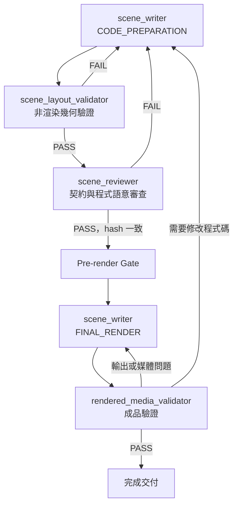

# Pre-render Layout and Render Output QA Design

## Purpose

重新定義演算法動畫 skill 的第四、第五階段，將「程式碼是否可以安全渲染」與「渲染後影片是否可以交付」分成兩個獨立關卡。

本設計解決兩個問題：

1. 將目前放在渲染完成後的 layout audit 移到正式 render 之前，避免先產生已知版面錯誤的影片。
2. 保留獨立 scene reviewer 的必要語意審查，但移除其與 layout validator 重複的幾何判斷責任。

## Scope

本設計涵蓋：

- 五階段流程中的 `SCENE_IMPLEMENTATION` 與 `FINAL_RENDER_AND_QA`。
- `scene_writer`、`scene_layout_validator`、`scene_reviewer` 與 `rendered_media_validator` 的責任邊界。
- 渲染前與渲染後的 entry gate、exit gate、必要產物、版本綁定及失效規則。
- 將既有 `layout_auditor` 與 `render_output_auditor` 名稱改為更明確的角色名稱。

本設計不涵蓋：

- 四個 Scene 的教學內容或視覺設計本身。
- layout audit runner 的幾何演算法重寫。
- Manim 動畫 API 或旁白生成機制的重新設計。
- 將所有 layout warning 自動判斷為可忽略。

## Approved Five-stage Workflow

整體流程維持五個階段：

1. `ANIMATION_DESIGN`
2. `SCRIPT`
3. `VOICEOVER`
4. `SCENE_IMPLEMENTATION`
5. `FINAL_RENDER_AND_QA`

第四階段核准「可渲染的來源版本」；第五階段核准「可交付的影片成品」。



## Design Principles

### Separate semantic and geometric authority

`scene_reviewer` 是上游契約與程式語意的權威；`scene_layout_validator` 是實際 Manim mobject 幾何的權威。兩者不應各自對同一種問題給出模糊的第二個答案。

### Validate before expensive rendering

能在不產生影片的情況下發現的 construction、overflow、overlap 與容量問題，必須在第四階段解決。正式 render 只能在 layout 與語意 review 都通過後執行。

### Bind every gate to an immutable source version

所有渲染前 PASS 都必須記錄 `generated_algo_scene.py` 的 SHA-256。程式碼、會影響 layout 的執行環境或必要上游內容改變時，舊的 PASS 不可沿用。

### Treat the rendered video as a separate artifact

影片檔案不是程式碼審查的證據。影片產生後仍必須檢查檔案完整性、媒體 metadata、audio stream、duration、合併順序與 manifest 綁定。

## Stage 4: `SCENE_IMPLEMENTATION`

### Goal

產生忠實實作上游契約、通過非渲染 layout dry-run，並通過獨立程式碼審查的 `generated_algo_scene.py`。

本階段不得執行正式 Manim render、preview 或低畫質 render。過去留下的 MP4 不得作為本階段通過依據。

### Entry gate

開始前 coordinator 必須確認：

- `confirmed_requirements.md` 存在。
- `animation_design.md` 存在，且已完成內容審查及使用者核准。
- `animation_design_review.md` 明確為 `PASS`。
- `teaching_script.md` 存在。
- `script_review_result.md` 明確為 `PASS`。
- `voiceover.md`、`narration_manifest.json` 與必要音訊存在且通過驗證。
- 上述上游文件沒有已知未解決的衝突。
- 使用 subagent 的必要授權已取得。

任何 entry gate 不成立時，不得讓 writer 自行補寫上游內容或推測缺失資料。

### Subphase 4.1: `CODE_PREPARATION`

#### Owner

`scene_writer`，task name 為 `scene_writer`，使用 `CODE_PREPARATION` 模式。

#### Responsibilities

- 依四-scene contract 實作四個獨立 Manim Scene。
- 忠實實作 requirements、approved animation design、teaching script 與 voiceover constraints。
- 寫 code 前規劃 zones、peak states、pointer co-location 與物件生命週期。
- 完成 code 後重新從頭閱讀 `generated_algo_scene.py`。
- 執行 syntax、import 及不產生影片的基本 construction checks。
- 建立 `scene_code_review_handoff.md`。
- 計算並記錄目前 `generated_algo_scene.py` 的 SHA-256。
- 記錄所有非平凡、最小且可追溯的 `Render Assumptions`。

#### Required outputs

- `<project-root>/generated_algo_scene.py`
- `<project-root>/scene_code_review_handoff.md`

#### Prohibitions

`scene_writer` 在此模式不得：

- 執行 preview、低畫質或正式 Manim render。
- 建立 `layout_audit_result.md` 的 PASS 結果。
- 建立 `scene_review_result.md` 的 PASS 結果。
- 將 writer 自行檢查宣稱為獨立 review PASS。

### Subphase 4.2: `LAYOUT_VERIFICATION`

#### Owner

`scene_layout_validator`，task name 為 `scene_layout_validator`。

此名稱取代原本的 `layout_auditor`。名稱明確表示它驗證的是 Scene 的實際 layout 與幾何狀態，而不是整體演算法語意。

#### Inputs

- `generated_algo_scene.py`
- `scene_code_review_handoff.md`
- `references/layout-audit.md`
- `scripts/run_layout_audit.py`

#### Procedure

對每一個交付的 Scene class 執行非渲染 dry-run：

```bash
python <absolute-runner-path> \
  <absolute-project-root>/generated_algo_scene.py \
  <SceneClass> \
  --audit-visible \
  --fail-on-warning \
  --visible-report-level warning
```

runner 會建立 Manim mobjects、將動畫跳到終態、跳過 wait 與 sound playback，但不寫入影格或 MP4。

#### Responsibilities

- 確認 Scene 可以完成 dry-run construction。
- 檢查可視物件是否超出 frame。
- 檢查可視物件是否發生非預期 overlap。
- 檢查文字、panel、labels、主要結構與 transient objects 的容量和間距。
- 確認四個 Scene 都已受檢。
- 必要時要求 `scene_writer` 加入或修正 scene-specific layout adapter。
- 記錄完整命令、exit code 與 audit output。

#### Non-responsibilities

`scene_layout_validator` 不負責：

- 判斷演算法步驟是否正確。
- 判斷 teaching script 是否忠實。
- 修改 scene code、audit runner 或上游文件。
- 人工忽略 warning。
- 使用過去的 MP4 取代目前版本的 dry-run。

#### Required output

建立 `<project-root>/layout_audit_result.md`，至少包含：

- `Result: PASS` 或 `Result: FAIL`。
- `Audited Code SHA-256`。
- audit runner SHA-256。
- Manim 版本。
- frame width 與 frame height。
- 每個受檢 Scene class。
- 實際執行命令。
- exit code。
- 完整 audit output。
- 所有 blocking findings 與修復目標 `SCENE_IMPLEMENTATION`。

只有四個 Scene 的 audit exit code 全部為 `0`，才能產生 `PASS`。

若 layout audit 為 `FAIL`，coordinator 必須把 findings 交回 `scene_writer`；不得在 layout 未通過時派遣 scene reviewer。

### Subphase 4.3: `CONTRACT_REVIEW`

#### Owner

獨立 `scene_reviewer`，task name 為 `scene_reviewer`。

#### Inputs

- `confirmed_requirements.md`
- `animation_design.md`
- `teaching_script.md`
- `generated_algo_scene.py`
- `scene_code_review_handoff.md`
- `layout_audit_result.md`
- `references/how-to-review-manim-scene-code.md`

#### Responsibilities

`scene_reviewer` 的唯一審查範圍為：

- implementation fidelity。
- 演算法步驟與 state update 正確性。
- pointer、highlight、support structure 與 movement 的教學語意。
- 四個 Scene 及其主要 beat 是否完整。
- Transform、ReplacementTransform 與 current reference ownership。
- helper、label、highlight 的建立、更新及移除生命週期。
- Scene cleanup 與 phase 邊界。
- Render Assumptions 是否最小、保守且可追溯。
- layout audit 是否涵蓋四幕，且其 `Audited Code SHA-256` 與目前程式碼一致。

`scene_reviewer` 不再重新猜測實際 bounding-box collision。幾何狀態以 `scene_layout_validator` 的有效結果為準；reviewer 只確認該結果存在、完整且與目前版本綁定。

#### Required output

建立 `<project-root>/scene_review_result.md`，至少包含：

- `Result: PASS` 或 `Result: FAIL`。
- `Reviewed Code SHA-256`。
- layout audit status。
- layout audited code hash。
- 分類後 findings。
- 程式碼 evidence references。
- 每一個 blocking finding 的修復目標 `SCENE_IMPLEMENTATION`。

### Stage 4 exit gate

只有以下條件全部成立，才能進入第五階段：

- `generated_algo_scene.py` 存在。
- `scene_code_review_handoff.md` 存在。
- `layout_audit_result.md` 明確為 `PASS`。
- `scene_review_result.md` 明確為 `PASS`。
- 四個 Scene 都已受 layout validation。
- 目前版本尚未執行正式 Manim render。
- 下列 code hash 完全一致：
  - 目前 `generated_algo_scene.py`。
  - handoff 的 `Code SHA-256`。
  - layout result 的 `Audited Code SHA-256`。
  - scene review 的 `Reviewed Code SHA-256`。
  - scene review 記錄的 layout-audited hash。
- layout validator 使用的 Manim、frame geometry、字型及 runner environment 與預定 render environment 相容。

若任一條件不成立，不能進入 `FINAL_RENDER_AND_QA`。

## Stage 5: `FINAL_RENDER_AND_QA`

### Goal

只渲染第四階段核准的 code 版本，並對實際產生的 Scene MP4 與合併影片執行獨立成品驗證。

本階段不重新執行 layout audit，也不重新審查演算法語意。

### Entry gate

開始前 coordinator 必須確認：

- 第四階段所有必要產物存在。
- layout validation 與 scene review 都為 `PASS`。
- 所有 code hash 與目前 `generated_algo_scene.py` 一致。
- 第四階段完成後程式碼沒有變更。
- layout-affecting Manim、字型、frame geometry 與 render profile 沒有變更。
- 沒有把舊版本 MP4 當成目前版本的 render evidence。

### Subphase 5.1: `FINAL_RENDER`

#### Owner

`scene_writer`，task name 為 `scene_writer`，使用 `FINAL_RENDER` 模式。原本的 writer session 應優先續用；真正的 gate 身分由 code hash 決定，而不是由 agent 對話身分決定。

#### Responsibilities

- 再次計算目前 code hash。
- 確認目前 code hash 與第四階段所有 PASS 完全一致。
- 依核准 render profile 渲染四個 Scene。
- 依核准順序合併四個 Scene。
- 建立 `render_manifest.md`。

#### Prohibitions

`scene_writer` 在 `FINAL_RENDER` 模式不得：

- 修改 `generated_algo_scene.py`。
- 在 render 中偷偷修補 layout 或語意問題。
- 使用舊 PASS 渲染修改後的 code。
- 自行建立 rendered-media QA 的 PASS。

若技術修復需要修改 code，writer 必須回報 `BLOCKED`，由 coordinator 讓 Stage 4 重新開始。

#### Required outputs

- 四個 Scene MP4。
- 最終合併 MP4。
- `<project-root>/render_manifest.md`。

`render_manifest.md` 至少記錄：

- Approved Code SHA-256。
- Manim 版本與 render profile。
- 每個 Scene class。
- 每個 render command。
- 每個 MP4 的絕對路徑、SHA-256、檔案大小及修改時間。
- 每個 MP4 的 duration、resolution、frame rate 與 audio stream 資訊。
- 合併順序與合併 command。
- 最終合併影片的 SHA-256 與 metadata。

### Subphase 5.2: `DELIVERY_QA`

#### Owner

獨立 `rendered_media_validator`，task name 為 `rendered_media_validator`。

此名稱取代原本的 `render_output_auditor`。名稱表示它驗證的是已渲染的影片與音訊媒體，而不是重新審查 scene code。

#### Inputs

- `generated_algo_scene.py`
- `scene_code_review_handoff.md`
- `layout_audit_result.md`
- `scene_review_result.md`
- `narration_manifest.json`
- `render_manifest.md`
- 四個 Scene MP4。
- 最終合併 MP4。

#### Responsibilities

- 驗證 `render_manifest.md` 對應第四階段核准的 code hash。
- 確認四個 Scene MP4 與合併影片存在且非空。
- 使用媒體工具完整 decode 每個影片，確認沒有檔案損壞。
- 檢查 resolution、frame rate、codec 與 render profile。
- 檢查必要的 audio stream 是否存在。
- 檢查 Scene duration 與合併影片 duration 的合理一致性。
- 檢查合併順序與 approved Scene 順序一致。
- 驗證 manifest 記錄的每個 MP4 SHA-256 與實際檔案一致。

#### Non-responsibilities

`rendered_media_validator` 不得：

- 修改 `generated_algo_scene.py`。
- 修改、覆蓋或重新編碼影片來取得 PASS。
- 重新判斷 layout 或演算法語意。
- 隱藏 decode、audio、hash 或 metadata 錯誤。

#### Required output

建立 `<project-root>/rendered_media_validation_result.md`，至少包含：

- `Result: PASS` 或 `Result: FAIL`。
- Approved Code SHA-256。
- Rendered Code SHA-256。
- 每個影片的檢查命令與 exit code。
- 實際 media metadata。
- 檔案 SHA-256 驗證。
- Scene 與 combined duration 驗證。
- audio stream 驗證。
- 合併順序驗證。
- 所有 blocking findings 與修復目標。

### Stage 5 exit gate

只有以下條件全部成立，整個 skill 才能完成：

- 四個 Scene MP4 均通過完整媒體檢查。
- 最終合併 MP4 通過完整媒體檢查。
- `render_manifest.md` 存在且內容完整。
- `rendered_media_validation_result.md` 明確為 `PASS`。
- render、review、layout 與目前程式碼的 code hash 一致。
- 所有 MP4 SHA-256 與 manifest 記錄一致。
- 沒有未解決的 blocking finding。

## Invalidation and Recovery Rules

| 變更或問題 | 失效範圍 | 回退位置 |
| --- | --- | --- |
| `generated_algo_scene.py` 有任何變更 | handoff、layout result、scene review、全部 render 產物及 rendered-media result | Stage 4 `CODE_PREPARATION` |
| layout runner、scene-specific adapter、Manim 版本、字型或 frame geometry 改變 | layout result、scene review 及全部 Stage 5 產物 | Stage 4 `LAYOUT_VERIFICATION` |
| requirements、animation design、script 或 voiceover 改變 | Stage 4 與 Stage 5 產物；必要時重新開啟其所屬上游 gate | 對應上游階段 |
| layout validation `FAIL` | layout result 不通過；不得進入 scene review | Stage 4 writer |
| scene review `FAIL` | scene review 不通過；任何 code 修正也使 layout result 失效 | Stage 4 writer |
| render command、暫存路徑或輸出目錄錯誤，但 code 與 render profile 不變 | manifest、相關 MP4 及 rendered-media result | Stage 5 `FINAL_RENDER` |
| MP4 遺漏、損壞、合併錯誤或 metadata 錯誤 | manifest、相關 MP4 及 rendered-media result | Stage 5 `FINAL_RENDER` |
| render 失敗且需要修改 code | Stage 4 與 Stage 5 全部產物 | Stage 4 writer |
| render profile 改變且可能影響 layout | layout result、scene review 及 Stage 5 全部產物 | Stage 4 `LAYOUT_VERIFICATION` |
| 以相同 code hash、相同環境與相同 profile 重新 render | 保留 Stage 4 PASS；Stage 5 render 產物失效 | Stage 5 `FINAL_RENDER` |

所有修正都必須由負責該階段的 agent 執行。Coordinator 不得直接修改 code 或以手動刪除 finding 的方式取得 PASS。

## Agent Responsibility Matrix

| Agent | 可以做 | 不可以做 |
| --- | --- | --- |
| `coordinator` | 委派、核對產物、驗證 hash、執行 gate、路由失敗 | 代替獨立 agent 判定 review PASS |
| `scene_writer` | 寫 code、執行 writer self-check、修正 findings、依核准版本 render | 審查自己的 code、建立獨立 review PASS、在 PASS 後偷偷改 code |
| `scene_layout_validator` | 執行非渲染 Scene 幾何驗證、建立 layout result | 修改 code、審查演算法語意、忽略 warning、執行正式 render |
| `scene_reviewer` | 審查需求與設計忠實性、演算法 state、lifecycle、assumptions | 修改 code、執行 render、重新取代 layout validator 的幾何判定 |
| `rendered_media_validator` | 驗證 MP4、音訊、metadata、duration、合併順序與 hash | 修改 code、修改影片、重新執行 layout audit、隱藏成品錯誤 |

## Required Documentation Changes

實作本設計時，至少需要同步更新：

- `manim-algorithm-animation-maker/SKILL.md`：將第四階段改為 `SCENE_IMPLEMENTATION`，第五階段改為 `FINAL_RENDER_AND_QA`，並重寫兩階段的 gate 與回退規則。
- `references/subagent-layout-auditor.md`：改名為 `references/subagent-scene-layout-validator.md`，更新 role、inputs、task name 與渲染前責任。
- 新增 `references/subagent-rendered-media-validator.md`，定義第五階段成品驗證。
- `references/subagent-delegation-protocol.md`：將 `layout_auditor` 更新為 `scene_layout_validator`，加入 `rendered_media_validator`。
- `references/layout-audit.md`：將使用時機從渲染後 QA 改為 Stage 4 的非渲染 layout verification。
- `references/how-to-review-manim-scene-code.md`：移除 reviewer 對實際 layout collision 的重複權責，保留語意、state、lifecycle 與 assumptions 審查。
- `references/how-to-render-approved-manim-scenes.md`：改成只接受 Stage 4 的雙重 PASS，並輸出完整 render manifest。
- `agents/openai.yaml` 與其他角色 metadata：同步新的角色名稱與描述。

現有使用者未提交的其他 skill 重構不屬於本 spec 的自動修改範圍。

## Acceptance Criteria

本設計的 implementation 完成後，必須能證明：

- layout audit 在任何正式 render 之前執行。
- `scene_layout_validator` 不再被要求審查演算法語意。
- `scene_reviewer` 不再把無法可靠靜態推理的實際 bounding-box collision 當成主要責任。
- 四個 Scene 的 layout result 與 scene review 都綁定同一個 code hash。
- code 變更會使舊渲染前 PASS 失效。
- 正式 render 只使用 Stage 4 通過的 code。
- `rendered_media_validator` 能獨立驗證 Scene MP4、combined MP4、audio、duration、metadata、順序與 hash。
- 媒體輸出問題可留在 Stage 5 修復；需要修改 code 時會正確退回 Stage 4。
- 角色名稱、task name、reference 檔名與 delegation protocol 完全一致。
- `git diff --check` 通過，且所有文件沒有未解決的 TODO、TBD、矛盾 gate 或模糊失效規則。
